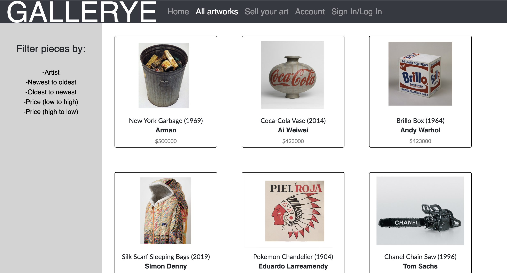
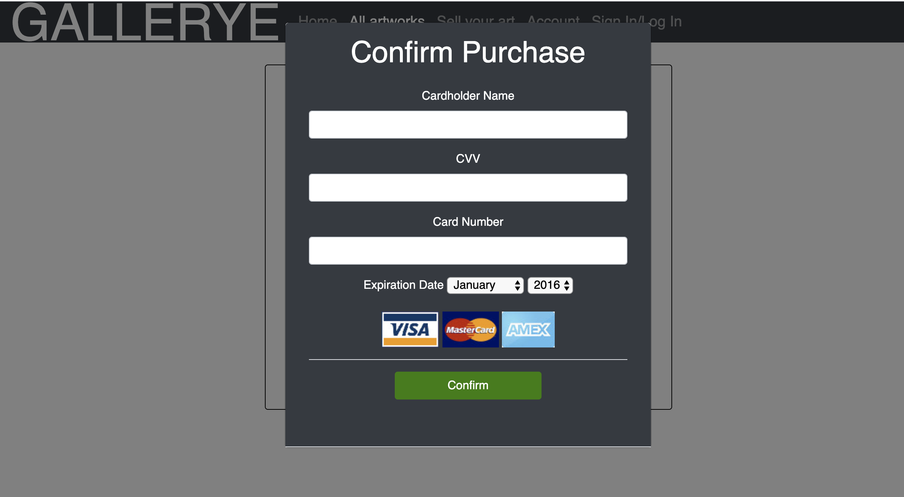

# Gallerye

Group proecjt during Bootcamp in Fullstack dev.

Project: Gallerye is an open-source E-commerce art site that allows artists and art collectors to buy/sell artworks directly sourced from other individuals. It represents a virtual gallery similar to Saatchi.com or Arnet.com.

Tools: HTML, CSS, AWS, SQL, Sequelize, Photoshop.

Challenges:

* Ensuring that sign-in/login/logout works.
* Allow artists to upload image files from their computer instead of providing a URL/image address (may need S3 bucket?).
* Paypal or other platform for payment.
* Bidding

